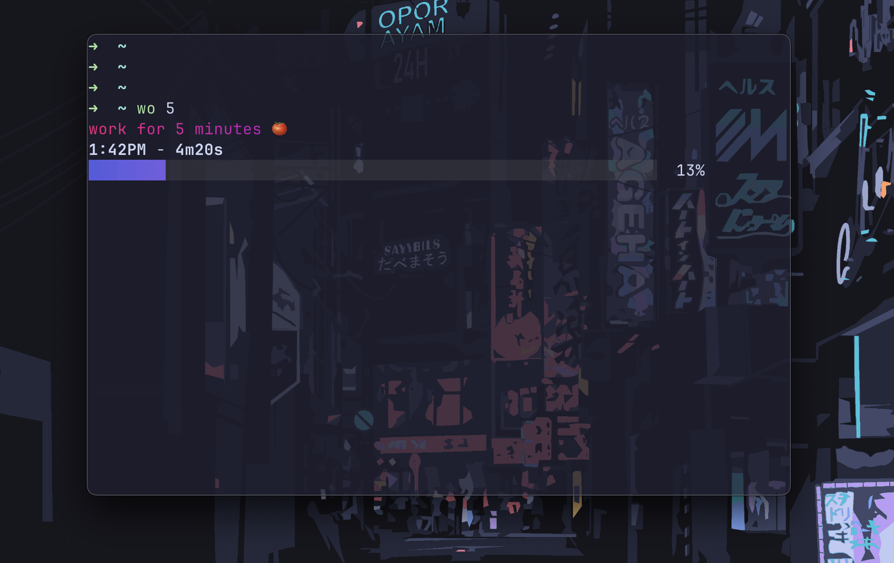

# Pomodoro Terminal Timer 🍅



A simple terminal-based Pomodoro timer written in Bash, using a clean timer and audio alert via `aplay` or `afplay`. 

This script supports work and break sessions with customizable durations and colorful output, designed for Windows (via WSL2), Linux and Mac users.

## Acknowledgements

I would like to mention this project was inspired by the work of [bashbunni](https://github.com/bashbunni).

Her script provided the foundation, which was tweaked to add the audio file and custom durations.

## Custom Sounds
You can use your own `.wav` file for the alert sound:
- Replace `alert.wav` with your own file.
- Move it to `~/.local/bin/` (or wherever your script is)
- Edit the `SOUND_FILE` path in `pomodoro.sh`
```bash
SOUND_FILE="$SCRIPT_DIR/your-custom-sound.wav"
```

## Features

- Work sessions (default: 45 minutes)
- Break sessions (default: 10 minutes)
- Audio alert using `alert.wav` (included)
- Colorful output with `lolcat` (optional)
- Compatible with Windows (WSL2) and Linux

## 🔧 Requirements

- **Bash** (pre-installed on Linux and WSL2)
- **`timer`** by [caarlos0](https://github.com/caarlos0/timer)
- **`aplay` or `afplay`** (via `alsa-utils` for playing the alert sound)
- **`lolcat`** for colorful output (optional)
- A terminal with `zsh` or `bash` for alias setup

## Installation

**(WSL2/Linux)** 

Install Dependencies:

Update your package manager and install `alsa-utils` and `lolcat`(optional):

```bash
sudo apt update
sudo apt install alsa-utils lolcat
```
Install timer [caarlos0](https://github.com/caarlos0/timer)

---

**(Mac)**

Install Dependencies:

[Install Homebrew](https://brew.sh/)

Install `timer` & `lolcat`
```bash
brew install caarlos0/tap/timer
```
```bash
brew install lolcat
```

Clone the Repository:

```bash
git clone https://github.com/rosscondie/cli-pomodoro-timer.git
cd cli-pomodoro-timer
```

Make the Script Executable:
```bash
chmod +x pomodoro.sh
```

Move the Script to a local bin directory:

This allows you to run `pomodoro.sh` from anywhere if it's in `~/.local/bin`

To make sure your shell recognizes it add this to your shell config file `~/.bashrc` or `~/.zshrc` if it is not already present:
```sh
export PATH="$HOME/.local/bin:$PATH"
```
Copy the script and sound file to `~/.local/bin` (create the directory if it doesn't exist):

```bash
mkdir -p ~/.local/bin 
cp pomodoro.sh alert.wav ~/.local/bin/
```
   
Set Up Aliases:
Add the following to your `~/.zshrc` or `~/.bashrc`:

```bash
source ~/.local/bin/pomodoro.sh
alias wo="pomodoro work"
alias br="pomodoro break"
```
Reload your shell config:
```bash
source ~/.zshrc 
# or source ~/.bashrc
```

## Usage

Start a work session (45 minutes by default):
```bash
wo
```

Start a break session (10 minutes by default):
```bash
br
```

Specify a custom duration (e.g. 25m work session or 5m break session):
```bash
wo 25

# for the break session
br 5
```
